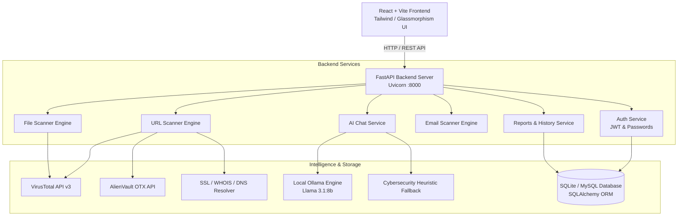

# 🛡️ ThreatShield AI — Unified Threat Detection and Analysis Platform

[](https://fastapi.tiangolo.com/)
[](https://reactjs.org/)
[](https://vitejs.dev/)
[](https://www.python.org/)
[](https://ollama.ai/)
[](https://opensource.org/licenses/MIT)

> **ThreatShield AI** is an end-to-end, AI-powered cybersecurity platform engineered to detect, inspect, and mitigate modern cyber threats across multiple attack vectors. Built with a high-performance **FastAPI** backend and an interactive **React** frontend, it integrates multi-engine threat intelligence, heuristic inspection algorithms, and an on-premise **Llama 3.1 LLM** security assistant.

---

## 📌 Table of Contents

- [Overview](#-overview)
- [Key Features](#-key-features)
  - [1. URL Threat Scanner](#1--url-threat-scanner)
  - [2. File Malware & Hash Scanner](#2--file-malware--hash-scanner)
  - [3. Email Phishing & Header Analyzer](#3--email-phishing--header-analyzer)
  - [4. AI Cybersecurity Assistant (ThreatShield AI)](#4--ai-cybersecurity-assistant-threatshield-ai)
  - [5. Threat Intelligence Dashboard & Analytics](#5--threat-intelligence-dashboard--analytics)
  - [6. Security Reports & History](#6--security-reports--history)
  - [7. Authentication & Access Control](#7--authentication--access-control)
- [System Architecture](#-system-architecture)
- [Tech Stack](#-tech-stack)
- [Directory Structure](#-directory-structure)
- [Getting Started](#-getting-started)
  - [Prerequisites](#prerequisites)
  - [Backend Setup](#backend-setup-fastapi)
  - [Frontend Setup](#frontend-setup-react--vite)
  - [Ollama Setup (AI Assistant)](#ollama-setup-ai-assistant)
- [API Endpoints Reference](#-api-endpoints-reference)
- [Security & Environment Variables](#-security--environment-variables)
- [Contributing & Team](#-contributing--team)

---

## 🌐 Overview

Modern organizations face decentralized and blended cyber threats: phishing emails, weaponized attachments, malicious shortened URLs, and zero-day exploits. **ThreatShield AI** unifies detection across these vectors into a cohesive command center, enabling users and security analysts to:
- Assess risks with instantaneous heuristic and reputation scoring.
- Correlate external intelligence from **VirusTotal** and **AlienVault OTX**.
- Query an interactive, private **AI Security Assistant** powered locally by **Ollama (Llama 3.1 8B)** without sending sensitive logs to third-party clouds.

---

## 🚀 Key Features

### 1. 🔗 URL Threat Scanner
- **Rule-Based Heuristic Engine:**
  - Evaluates protocol security (HTTPS vs HTTP).
  - Flags raw IP hostnames (e.g., `http://192.168.1.1/login`).
  - **Nested Subdomain & Brand Impersonation Detection:** Flags nested subdomains (e.g. `paypal.com.attacker.xyz`) and excessive subdomain depth.
  - **Redirect-Chain & Final URL Analysis:** Follows HTTP redirects to evaluate cross-domain redirection and hop count.
  - Phishing keyword scanning (`secure-login`, `verify-account`, `banking`, etc.).
  - Known URL shortener detection (`bit.ly`, `tinyurl`, `t.co`, etc.).
- **Live Threat Intelligence:**
  - Integrated with **VirusTotal API v3** for multi-engine malicious detection ratios.
  - Correlated with **AlienVault OTX (Open Threat Exchange)** for active pulse indicators.
- **Deep Network & Identity Inspection:**
  - **SSL/TLS Certificate Inspection:** Issuer, validity window, days remaining, expiry alerts.
  - **WHOIS Domain Analysis & Age Calculation:** Registrar, registration dates, and domain age calculation (new domains < 30 days flagged as high risk).

### 2. 📁 File Malware & Hash Scanner
- **Cryptographic Hash Generation:** Automatically computes `MD5`, `SHA-1`, and `SHA-256` hashes upon upload.
- **Shannon Entropy Analysis:** Computes byte-level entropy (0.0 to 8.0) to detect packed, obfuscated, or encrypted payloads.
- **Magic-Byte Signature & Type Detection:** Inspects true file headers (PE Executables, PDFs, Archives, Office OpenXML, Images, Scripts).
- **Extension Mismatch Flagging:** Automatically detects and alerts on deceptive masquerading files (e.g. Windows executables disguised with `.pdf` or `.jpg` extensions).
- **Threat Reputation Lookup:** Queries VirusTotal database using file hashes to detect known trojans, ransomware, and spyware.

### 3. 📧 Email Phishing & Header Analyzer
- **Real Header & EML Parsing:** Parses raw RFC822 email headers and `.eml` multipart structures.
- **Protocol Authentication Detection:** Extracts and verifies SPF, DKIM, and DMARC verdicts from `Authentication-Results` and `Received-SPF` headers.
- **Header Alignment & Spoofing Detection:** Checks for domain mismatches between `From`, `Reply-To`, and `Return-Path`.
- **Dangerous Attachment Detection:** Scans attached files for high-risk executable or script extensions.
- **Content & Link Inspection:** Scans body copy for urgency triggers, credential lures, and extracts embedded links for automatic URL safety analysis.

### 4. 🤖 AI Cybersecurity Assistant (ThreatShield AI)
- **Local & Private LLM:** Powered by **Ollama (`llama3.1:8b`)** with support for Qwen models running on-premise for privacy.
- **Active Scan Context Integration:** Capable of directly receiving URL, Email, or File scan results as context to provide tailored threat explanations and actionable mitigation steps.
- **Automatic Fallback Engine:** Built-in heuristic cybersecurity advisor providing structured threat explanations even when Ollama is offline.

### 5. 📊 Threat Intelligence Dashboard & Analytics
- Real-time security metrics: Total Scans, Malicious Detections, Suspicious Entities, Clean Status.
- Visual Threat Score gauge with dynamic color states (Safe, Low, Moderate, High, Critical).
- Quick scan launchpads and interactive recent activity feeds.

### 6. 📄 Security Reports & PDF Export
- User-isolated threat history ensuring analysts only view their own scan records.
- Filter and search reports by scan type (`URL`, `File`, `Email`) and status.
- **Download Professional PDF Report:** One-click PDF generation featuring threat badges, checklists, forensics data, and incident response recommendations.

### 7. 🔐 Authentication & Access Control
- JWT (JSON Web Token) bearer authentication with PBKDF2 password hashing.
- Protected scanner and report API endpoints validating `Authorization: Bearer <token>`.
- Client-side route protection and Axios authorization interceptors.

---

## 🏗️ System Architecture



---

## 💻 Tech Stack

| Layer | Technology | Purpose |
|---|---|---|
| **Frontend** | React 18, Vite | High-performance Single Page Application (SPA) |
| **Styling** | Modern CSS3 / Glassmorphism | Dark cybersecurity command center theme |
| **Icons & UI** | Lucide React | Clean, responsive security icons |
| **HTTP Client** | Axios | Frontend API requests & bearer token management |
| **Backend** | FastAPI (Python 3.10+) | High-speed asynchronous RESTful API framework |
| **ASGI Server** | Uvicorn | ASGI web server running on port `8000` |
| **Database** | SQLite / MySQL | Persistent storage for users, scans, and reports |
| **ORM** | SQLAlchemy 2.0 | Python Object Relational Mapping |
| **AI / LLM** | Ollama (`llama3.1:8b`) | On-premise private AI chatbot for cybersecurity |
| **Threat Intel** | VirusTotal v3, AlienVault OTX | External threat indicators and malware database |

---

## 📁 Directory Structure

```text
AI-Powered-Unified-Threat-Detection-and-Analysis-Platform/
├── .gitignore                      # Git ignore configuration
├── README.md                       # Complete project documentation
│
├── backend/                        # FastAPI Backend Application
│   ├── .env.example                # Template for environment configuration
│   ├── main.py                     # FastAPI application entrypoint & CORS setup
│   ├── requirements.txt            # Python dependencies
│   ├── test_url_scanner.py         # Automated unit test suite for scanner
│   │
│   ├── api/                        # API route handlers
│   │   ├── auth.py                 # User registration & JWT login
│   │   ├── chat.py                 # AI assistant with Ollama & fallback
│   │   ├── email_scan.py           # Email header & phishing analyzer
│   │   ├── file_scan.py            # File hash & malware scanner
│   │   ├── health.py               # Server health check endpoint
│   │   ├── reports.py              # Scan history and statistics
│   │   └── url.py                  # URL detection, SSL, WHOIS, & Threat Intel
│   │
│   └── database/                   # Database configuration & models
│       ├── db.py                   # SQLAlchemy engine and session factory
│       └── models.py               # ORM models (User, ScanRecord, etc.)
│
└── frontend/                       # React + Vite Frontend Application
    ├── package.json                # Frontend package dependencies & scripts
    ├── vite.config.js              # Vite configuration & backend proxy
    ├── index.html                  # HTML entry point
    │
    └── src/
        ├── App.jsx                 # Main application component & routes
        ├── main.jsx                # React root mount
        ├── index.css               # Global theme & glassmorphic styling
        │
        ├── components/             # Reusable UI widgets
        │   ├── CheckDetails.jsx    # Security checklist display
        │   ├── IntelReportCard.jsx # VirusTotal & OTX intelligence card
        │   ├── protectedroute.jsx  # Route guard for authenticated pages
        │   ├── SslDetailsCard.jsx  # SSL/TLS certificate viewer
        │   ├── ThreatScoreGauge.jsx# Dynamic radial threat score gauge
        │   ├── UrlScanner.jsx      # Interactive URL analysis tool
        │   └── WhoisDetailsCard.jsx# Domain registration details card
        │
        └── pages/                  # Page views
            ├── aichat.jsx          # AI Security Assistant interface
            ├── dashboard.jsx       # Unified Threat Command Dashboard
            ├── emailscan.jsx       # Email phishing scanner page
            ├── filescan.jsx        # File malware scanner page
            ├── login.jsx           # User authentication page
            ├── reports.jsx         # Scan reports & history viewer
            └── urlscan.jsx         # URL threat analysis page
```

---

## 🛠️ Getting Started

### Prerequisites
- **Python**: Version `3.10` or higher
- **Node.js**: Version `18.0` or higher (includes `npm`)
- **Git** installed on your system
- *(Optional)* **Ollama**: For local AI chat assistant ([Download Ollama](https://ollama.ai/))

---

### Backend Setup (FastAPI)

1. **Navigate to the backend directory:**
   ```powershell
   cd backend
   ```

2. **Create and activate a Python virtual environment (Recommended):**
   ```powershell
   python -m venv venv
   # On Windows (PowerShell):
   .\venv\Scripts\Activate.ps1
   ```

3. **Install backend dependencies:**
   ```powershell
   pip install -r requirements.txt
   ```

4. **Set up Environment Variables:**
   Copy the example `.env` file:
   ```powershell
   copy .env.example .env
   ```
   Open `backend/.env` and add your API keys:
   ```env
   DB_HOST=localhost
   DB_USER=root
   DB_PASSWORD=yourpassword
   DB_NAME=cyber_platform

   VIRUSTOTAL_API=your_virustotal_api_key_here
   OTX_API=your_alienvault_otx_api_key_here

   OLLAMA_URL=http://localhost:11434
   ```
   *(Note: The platform works with built-in heuristic detection even without external API keys).*

5. **Start the FastAPI backend server:**
   ```powershell
   uvicorn main:app --reload --port 8000
   ```
   Backend will be running at: **`http://localhost:8000`**  
   Interactive API Docs (Swagger): **`http://localhost:8000/docs`**

---

### Frontend Setup (React + Vite)

1. **Open a new terminal and navigate to the frontend directory:**
   ```powershell
   cd frontend
   ```

2. **Install frontend dependencies:**
   ```powershell
   npm install
   ```

3. **Start the Vite development server:**
   ```powershell
   npm run dev
   ```
   Frontend will be running at: **`http://localhost:5173`**

---

### Ollama Setup (AI Assistant)

To use your local Llama model for the **AI Security Assistant**:

1. Open Ollama from your desktop application or run:
   ```powershell
   ollama serve
   ```
2. Pull the model (if not already downloaded):
   ```powershell
   ollama run llama3.1:8b
   ```
3. The backend will automatically connect to `http://localhost:11434` and prioritize `llama3.1:8b`. If Ollama is closed, the assistant seamlessly switches to the built-in cybersecurity rule-based engine.

---

## 📡 API Endpoints Reference

| Method | Endpoint | Auth | Description |
|---|---|---|---|
| `GET` | `/health` | Public | Server status and health check |
| `POST` | `/auth/register` | Public | Register a new analyst account and return JWT access token |
| `POST` | `/auth/login` | Public | Authenticate user credentials and return JWT access token |
| `GET` | `/auth/me` | Bearer JWT | Retrieve currently authenticated user profile |
| `POST` | `/url/scan` | Bearer JWT | Deep URL inspection (Heuristics, Redirect chain, WHOIS age, SSL, VirusTotal, OTX) |
| `POST` | `/file/scan` | Bearer JWT | File forensics (MD5, SHA-1, SHA-256, Shannon Entropy, Magic Bytes, VirusTotal) |
| `POST` | `/email/scan` | Bearer JWT | Email inspection (EML/Headers, SPF, DKIM, DMARC, Reply-To spoofing, Body links) |
| `POST` | `/chat/` | Public | AI Security Assistant (Context-aware explanation via Ollama Llama 3.1 8B / Qwen) |
| `GET` | `/reports/stats` | Bearer JWT | User dashboard statistics (total scans, threats detected, type & status counts) |
| `GET` | `/reports/` | Bearer JWT | Fetch user's historical threat scan reports with query filters |
| `GET` | `/reports/{id}` | Bearer JWT | Retrieve comprehensive forensic details of a specific scan |
| `GET` | `/reports/{id}/pdf`| Bearer JWT | **Download professional PDF threat intelligence report** |
| `DELETE` | `/reports/{id}`| Bearer JWT | Delete specific threat scan log record |

---

## 🔒 Security & Environment Variables

> [!CAUTION]
> **Never commit your `.env` file containing secret keys to Git!**  
> Ensure `.env` is listed in your `.gitignore`. Use `.env.example` to provide template variables to teammates.

- **VirusTotal API Key:** Free API keys are available at [virustotal.com](https://www.virustotal.com/).
- **AlienVault OTX Key:** Free community keys are available at [otx.alienvault.com](https://otx.alienvault.com/).
- **JWT Secret:** Configure a strong cryptographic secret key for production deployments.

---

## 👥 Contributing & Team

Developed as part of the **5th Semester Software Group Project (SGP)**:

- **Repository:** [Harshil7104/AI-Powered-Unified-Threat-Detection-and-Analysis-Platform](https://github.com/Harshil7104/AI-Powered-Unified-Threat-Detection-and-Analysis-Platform)
- **Branch:** `feature/week2-url-scanner`

---

## 📜 License

This project is open-source and licensed under the [MIT License](LICENSE).
